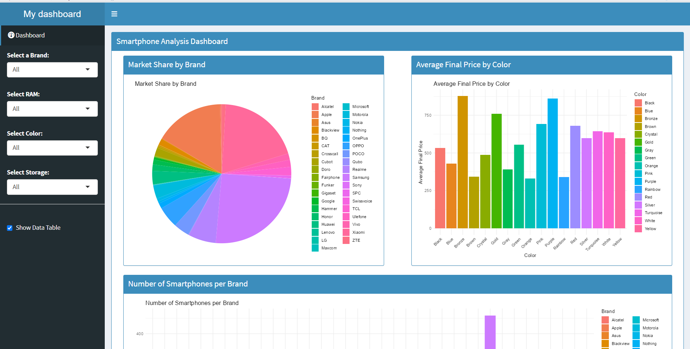
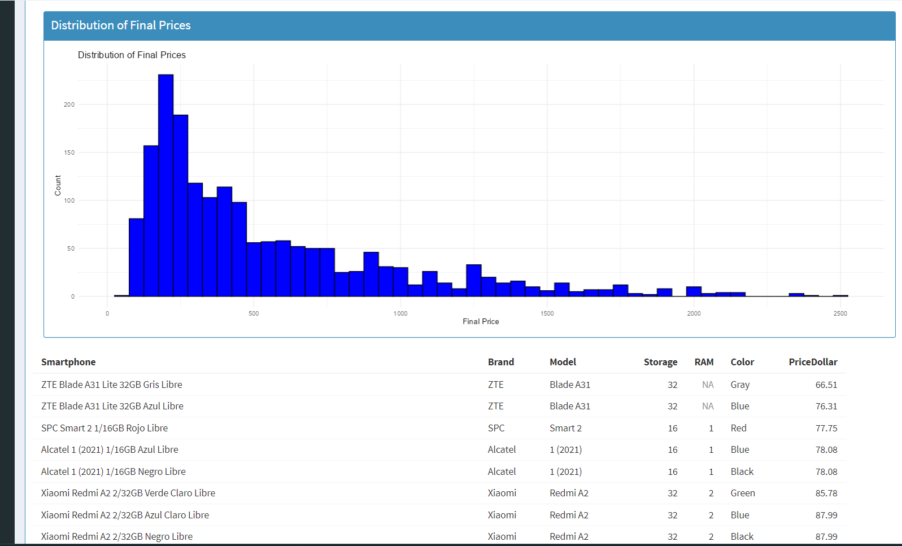

# Smartphone Data Analysis using R

### Authors
 - Meenu Mathew
 - Akshay Ramachandran

## Overview
This project involves analyzing smartphone data using R and R Markdown. The analysis includes data manipulation, visualization, and the creation of an interactive Shiny dashboard to explore various aspects of the smartphone dataset.

## Prerequisites
Make sure you have the following R packages installed:

- dplyr
- ggplot2
- shiny
- shinydashboard
- knitr

You can install them using the following commands:

- install.packages("dplyr")
- install.packages("ggplot2")
- install.packages("shiny")
- install.packages("shinydashboard")
- install.packages("knitr")

Project Structure
- smartphone_analysis.Rmd: The main R Markdown file containing the analysis and visualizations.
- smartphones.csv: The CSV file containing the smartphone dataset.
- README.md: This README file.

## Running the Analysis
- Open smartphone_analysis.Rmd in RStudio.
- Execute the code chunks by clicking the Run button within each chunk or by placing your cursor inside the chunk.
- To generate the PDF report, click the Knit button or press Ctrl+Shift+K.

## Data Analysis Steps
- Loading and Inspecting Data:

```R
data <- read.csv("smartphones.csv", header = TRUE)
head(data)
```


## Data Manipulation using dplyr:

- Arrange data by final price:
```R
arranged_data <- smartphones %>% arrange(Final.Price)
tail(arranged_data)


filtered_data <- smartphones %>% filter(RAM > 4)
head(filtered_data)

#Slice the first 5 rows:

sliced_data <- smartphones %>% slice(1:5)
print(sliced_data)

#Add a new column for price in dollars and arrange by final price:

mutated_data <- smartphones %>% mutate(PriceDollar = Final.Price * 1.1) %>% arrange(Final.Price)
tail(mutated_data)
```

## Visualization using ggplot2:

- Distribution of smartphone brands:

```R
ggplot(brand_counts, aes(x = "", y = Count, fill = Brand)) +
  geom_bar(width = 1, stat = "identity") +
  coord_polar("y", start = 0) +
  theme_void() +
  labs(title = "Distribution of Smartphone Brands")
```

## Shiny Dashboard
An interactive Shiny dashboard is included to explore the smartphone data.



- Running the Shiny App
- Ensure all required packages are installed.
- Run the Shiny app using the following command in your R console:



```R
shinyApp(ui = ui, server = server)
```

## Dashboard Features

- Market Share by Brand: Pie chart showing the market share of different smartphone brands.
- Average Final Price by Color: Bar chart showing the average final price of smartphones by color.
- Number of Smartphones per Brand: Bar chart showing the number of smartphones for each brand.
- Storage vs Final Price: Scatter plot showing the relationship between storage capacity and final price.
- Final Price Distribution by RAM Size: Box plot showing the distribution of final prices by RAM size.
- Distribution of Final Prices: Histogram showing the distribution of final prices.
